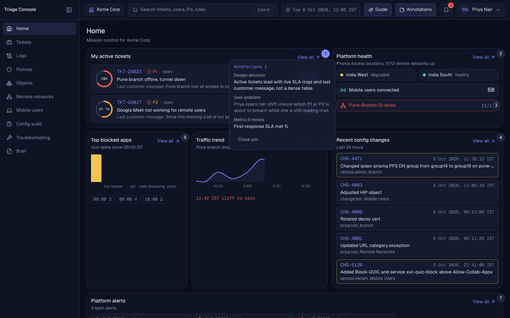
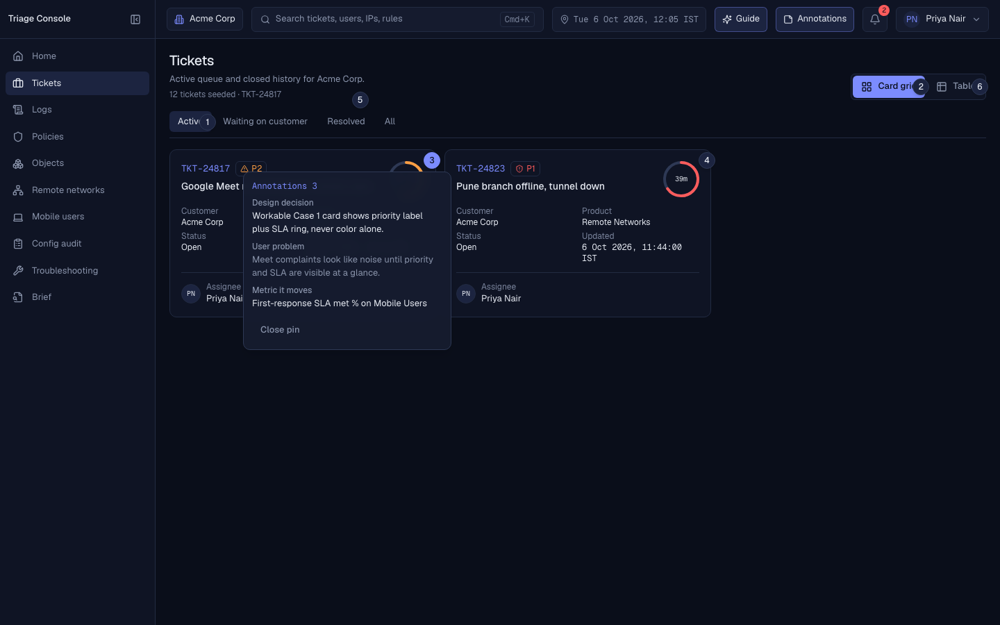
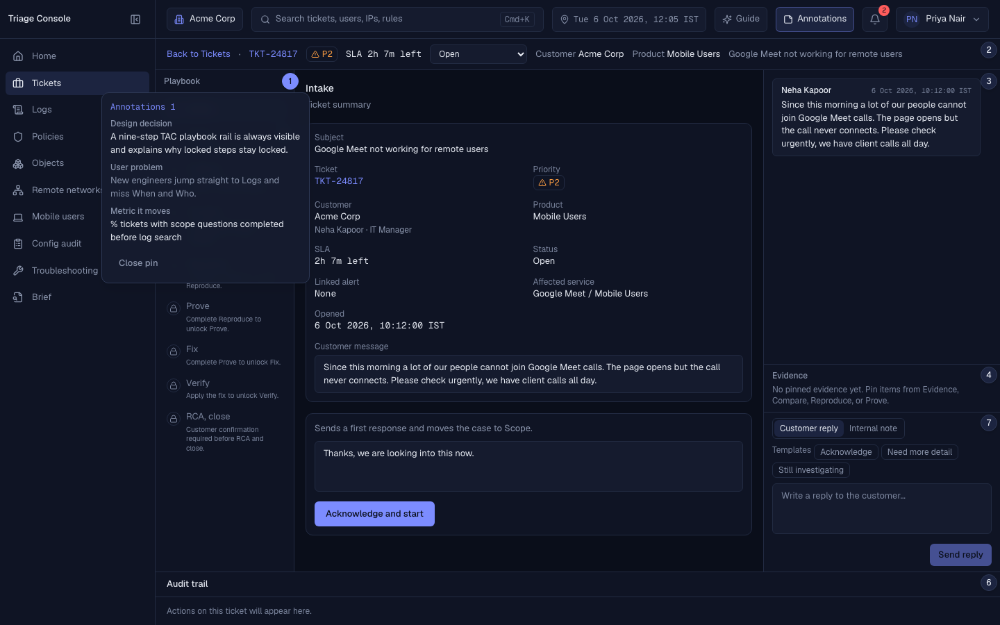

# Triage Console v2

Client-only Vite + React SPA that turns a vague Prisma Access style complaint into a TAC playbook path: scope, evidence, compare, reproduce, prove, fix with approval, verify, RCA.

## Problem

When Meet breaks for remote users or a branch tunnel goes down, the engineer jumps between alert, logs, policy, config history, and CLI. Context scatters. Time to root cause grows. Evidence gets lost before close.

## Persona

**Priya Nair**, Cloud Security TAC Engineer (L2). Holds 6 to 10 active tickets. Scopes first (when, who, what changed), then pins evidence, compares failing vs working, proves in CLI, never pushes without written approval, closes only after customer confirm.

## TAC playbook

1. Intake
2. Scope
3. Evidence
4. Compare
5. Reproduce
6. Prove
7. Fix with approval
8. Verify
9. RCA and close

## Review in 5 minutes

1. Open the live preview (or `npm run dev`).
2. Sign in as `admin` / `12345`.
3. Turn **Guide** on (default) and open **TKT-24817**. Follow coach marks; use **Do it for me** if you want a push.
4. Turn **Annotations** on. Walk Home, Tickets, and the ticket workspace pins.
5. Optionally run **TKT-24823** (Pune) the same way. **Reset demo** from the user menu to start over.

Demo clock is fixed at Tue 6 Oct 2026, 12:05 IST. It never reads the system clock.

## Login

| Field | Value |
|---|---|
| Username | `admin` |
| Password | `12345` |

Client-side demo auth only. Not real security.

## Annotated screenshots

Captured with Annotations on (see `docs/screenshots/`):

| Screen | File |
|---|---|
| Home |  |
| Tickets |  |
| Ticket workspace |  |

## Setup

```bash
npm install
npm run dev
```

## Scripts

| Script | Purpose |
|---|---|
| `npm run dev` | Vite dev server |
| `npm run build` | Typecheck + production build |
| `npm run preview` | Serve the production build |
| `npm run lint` | ESLint |
| `npm run typecheck` | TypeScript project references |
| `npm test` | Vitest unit tests |
| `npm run e2e` | Playwright against `vite preview` |
| `npm run generate` | Seed data generator |

## Stack

Vite, React 18, TypeScript strict, React Router (client only), Tailwind + Radix (shadcn), Zustand, TanStack Table + Virtual, Recharts, Motion, cmdk, lucide-react, Geist, date-fns, Vitest, Playwright. `vercel.json` rewrites all routes to `/index.html`.

## Docs

- [PLAN.md](PLAN.md) (source of truth)
- [docs/WRITEUP.md](docs/WRITEUP.md) (one page write-up)
- [docs/DEV_ACTION_ITEMS.md](docs/DEV_ACTION_ITEMS.md) (production backlog)
- [CURSOR_PROMPTS.md](CURSOR_PROMPTS.md)

## Live link

Add the Vercel preview URL here after deploy.

Built by Sarthak Pant.
